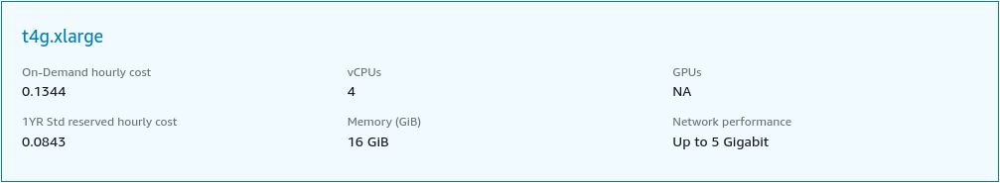
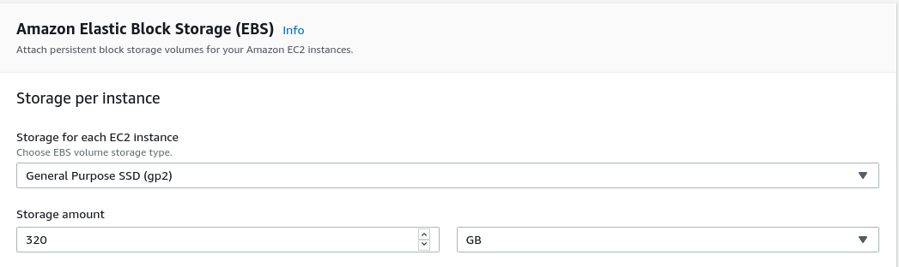
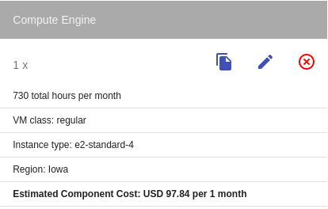
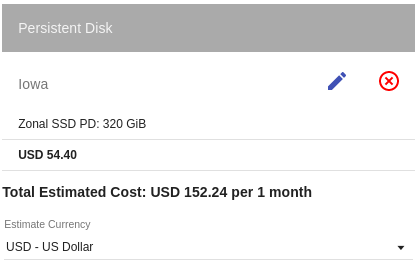
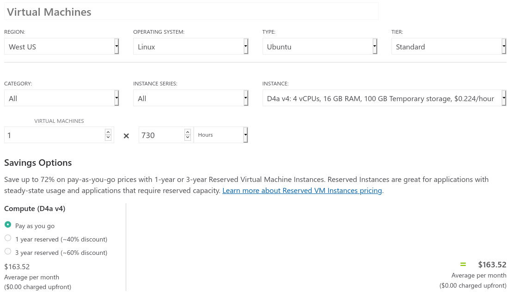
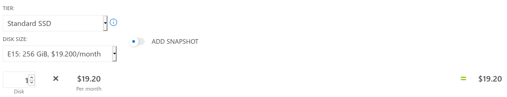
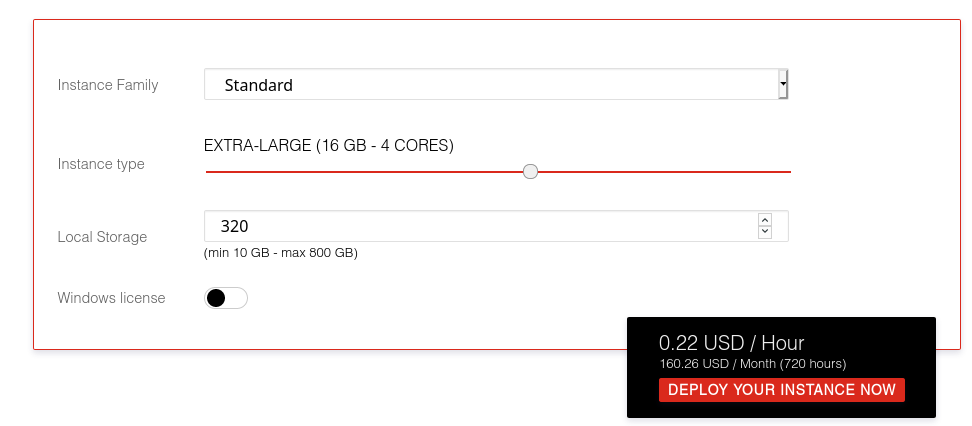

# Lab 05 - Cloud pricing

> Authors: Robin Demarta & Doran Kayoumi (a.k.a Roban Demayoumi)

## Task 1 - Compute Pricing

> Note: For all of the compute pricing, we've used the offered pricing calculator so we could match the demanded characteristics.

### t.l.d.r

|           | Price per month | Remarks                                                      |
| --------- | --------------- | ------------------------------------------------------------ |
| Amazon    | 93.54 USD       | Overall cheapest. Cheapest instance                          |
| Google    | 152.24 USD      | Most expensive disk storage                                  |
| Microsoft | 182.92 USD      | Most expensive overall. Most expensive instance and cheapest storage |
| Exoscale  | 160.26 USD      | VM and storage pricing aren't split                          |

### Amazon

For the virtual machine, we went with an Amazon EC2  `t4g.xlarge` instance.

Price: 61.54 USD / month

For storage, we went with an `Amazon Elastic Block Storage`.

Price: 32.00 USD / month

### Google

For the virtual machine, we went with an `e2-standard-4` instance.

Price : 97.84 USD / month

For storage, we went with a `Zonal SSD PD` disk

Price: 54.40 USD / month

### Microsoft

For the virtual machine, we went with a `D4a v4` instance. .

Price: 163.52 USD / month

> Note: This is a more expensive option but it covers the missing persistent storage. A cheaper alternative would be the `B4MS` instance which costs 144.54 USD / month

For storage, we went with an `E15` disk.

Price: 19.20 USD / month

### Exoscale

Exoscale doesn't seem to split the storage and instances in their pricing. So we went with a `Extra large` instance with a local storage of 320 GiB.

Price: 160.26 USD / Month

